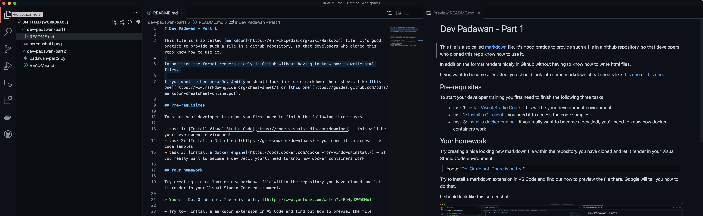

# Dev Padawan - Part 1

This file is a so called [markdown](https://en.wikipedia.org/wiki/Markdown) file. It's good pratice to provide such a file in a github repository, so that developers who cloned this repo know how to use it.

In addition the format renders nicely in Github without having to know how to write html files.

If you want to become a Dev Jedi you should look into some markdown cheat sheets like [this one](https://www.markdownguide.org/cheat-sheet/) or [this one](https://guides.github.com/pdfs/markdown-cheatsheet-online.pdf).

## Pre-requisites

To start your developer training you first need to finish the following three tasks

- task 1: [Install Visual Studio Code](https://code.visualstudio.com/download) - this will be your development environment
- task 2: [Install a Git client](https://git-scm.com/downloads) - you need it to access the code samples
- task 3: [Install a docker engine](https://docs.docker.com/docker-for-windows/install/) - if you really want to become a dev Jedi, you'll need to know how docker containers work


## Exercise 1 - The Clone Wars

Your first exercise will be to clone a github repository. 

For that open the command line interface on your computer (for windows users you can do that by pressing the windows key along with the **R** key, mac users open the **terminal** app).

Move to a folder where you want to have your code and type-in the following command:

```
git clone https://github.com/rui1610/dev-padawan-part1.git
```
This command will create a copy (a clone) from the code on the Github project to your local computer.

Now change to the newly created folder **dev-padawan-part1** and you can see the code.

To make the coding more fun, we'll start Visual Studio Code and open the folder we have just created (File >> Add Folder to Workspace).

If you got until here you've successfully master the first exercise. Congratulations!!!

## Your homework

Try creating a nice looking new markdown file within the repository you have cloned and let it render in your Visual Studio Code environment. 

> Yoda: "[Do. Or do not. There is no try!](https://www.youtube.com/watch?v=BQ4yd2W50No)"

~~Try to~~ Install a markdown extension in VS Code and find out how to preview the file there. Google will tell you how to do that.

It should look like this screenshot:


